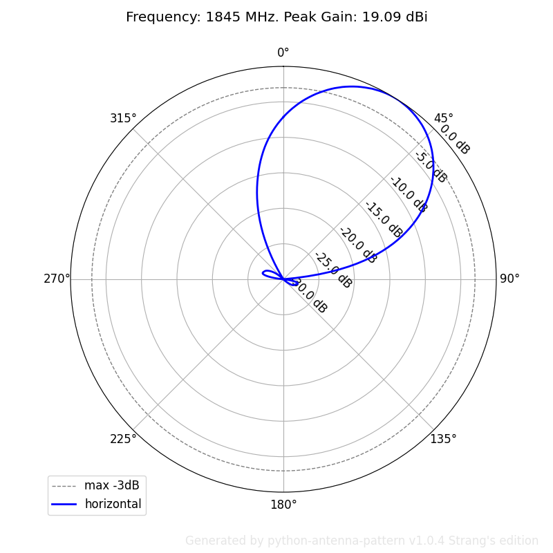

======================
python-antenna-pattern
======================

Generate antenna radiation pattern in polar coordinates using python.

* Free software: Apache Software License 2.0
* Documentation: https://python-antenna-pattern.readthedocs.io.

Features
--------

Simple cli to 
 * generate pdf, eps or png files from a planet pattern file
 * use individual file pattern file or all files by mask (2 only now)

Examples::

   python pyap -g -3 -f png -n TEST_ ./data/AMB4520R8v06_05T.msi
   python pyap -g -n TEST_ ./data/LTE-L_1960MHz_P1.txt  
   python pyap -g -n TEST_ "./data/*.txt" 

   Horizontal pattern generated for AMB4520R8v06_05T.msi

Usage
-----
::

   pyap [-h] [-v] [-s] [-g] [-3] [--show-name] [-r ROTATION_OFFSET]
        [-f {pdf,eps,png}] [-n FILE_NAME_PREFIX] [--fontsize FONTSIZE]
        [--size IMAGE_SIZE_X100PX]
        target_pattern_file

   positional arguments:
     pattern               use specified file or a directory with planet files

   options:
     -h, --help            show this help message and exit
     -v, --verbose         show extra diagnostic messages during execution
                           (default: False)
     -s, --show-fig        show figure, pause after each figure is generated
                           (default: False)
     -g, --show-legend     draw legend (default: False)
     -3, --show-3db        draw half-power line (max - 3dB) (default: False)
     --show-name           draw NAME attribute in caption (default: False)
     -r ROTATION_OFFSET, --rotation-offset ROTATION_OFFSET
                           rotational offset when plotting the polar pattern
                           (default: 0)
     -f {pdf,eps,png}, --filetype {pdf,eps,png}
                           file type of the output figure, pdf or eps or png
                           (default: pdf)
     -n FILE_NAME_PREFIX, --file-name-prefix FILE_NAME_PREFIX
                           prefix of the generated filename (default: PYAP_)
     --fontsize FONTSIZE   font size for texts on the chart (default: 12)
     --size IMAGE_SIZE     image size in 100px units (default: 8)

Credits
-------

Respect to Tsung-Yi Chen, original author of python-antenna-pattern v0.1.0.

Package was created with Cookiecutter_ and the `audreyr/cookiecutter-pypackage`_ project template.

.. _Cookiecutter: https://github.com/audreyr/cookiecutter
.. _`audreyr/cookiecutter-pypackage`: https://github.com/audreyr/cookiecutter-pypackage
