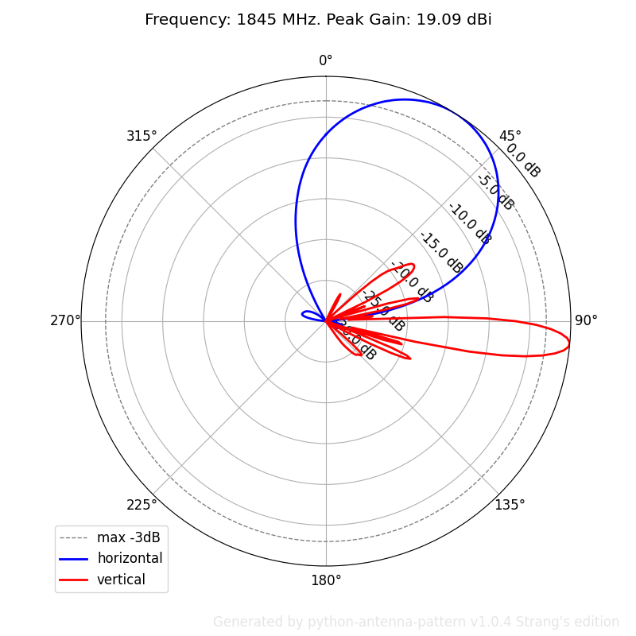

======================
python-antenna-pattern
======================

Generate antenna radiation pattern in polar coordinates using python.

* Free software: Apache Software License 2.0
* See also pafx2msi_: Antenna pattern convertor from PAFX to MSI format.

.. _pafx2msi: https://github.com/Strang00/pafx2msi

Features
--------

Simple cli to 
 * generate pdf, eps or png files from a planet pattern files
 * use individual file pattern file or several files by mask
 * simulate pattern having 59/7 width and optionally save MSI
 * merge multiple patterns to one and optionally save MSI
 * rotate horizontally or vertically and optionally save MSI

Examples::

   python pyap -l -3 -t png -p TEST_ -c ./data/AMB4520R8v06_05T.msi
   python pyap -l -m -t png -p TEST_ -n "./data/AMB4520R8v06_18*.*"
   python pyap -l -p TEST_ ./data/LTE-L_1960MHz_P1.txt  
   python pyap -l -p TEST_ "./data/*.txt" 

   Antenna pattern plotted for AMB4520R8v06_05T

Usage
-----
::

    pyap [-h] [-v] [-i] [-l] [-3] [-m] [-c] [-w] [-n] [-t {pdf,eps,png}]
         [-p FILE_PREFIX] [-rh ROTATION_H] [-rv ROTATION_V]
         [-o SAVE_SUFFIX] [-f FONT_SIZE] [-s SIMULATE_TILT] [-z IMAGE_SIZE]
         pattern

    positional arguments:
      pattern               use specified file or a directory with planet files

    options:
      -h, --help            show this help message and exit
      -v, --verbose         show extra diagnostic messages during execution
                            (default: False)
      -i, --show-image      show image and pause after each figure is generated
                            (default: False)
      -l, --show-legend     show legend (default: False)
      -3, --show-3db        show half-power line (max - 3dB) (default: False)
      -m, --merge           merge multiple sources to one pattern (default: False)
      -c, --combine         combine horizontal and vertical patterns on chart
                            (default: False)
      -w, --hide-watermark  hide watermark with version (default: False)
      -n, --show-name       show NAME attribute in caption (default: False)
      -t {pdf,eps,png}, --file-type {pdf,eps,png}
                            file type of the output figure, pdf or eps or png
                            (default: pdf)
      -p FILE_PREFIX, --file-prefix FILE_PREFIX
                            prefix of the generated filename (default: None)
      -rh ROTATION_H, --rotation-horizontal ROTATION_H
                            horizontal rotational offset (default: 0)
      -rv ROTATION_V, --rotation-vertical ROTATION_V
                            vertical rotational offset (default: 0)
      -o SAVE_SUFFIX, --output SAVE_SUFFIX
                            resave pattern with passed suffix (default: None)
      -f FONT_SIZE, --font-size FONT_SIZE
                            font size for texts on the chart (default: 12)
      -s SIMULATE_TILT, --simulate SIMULATE_TILT
                            simulate diagramm pattern using TILT (default: None)
      -z IMAGE_SIZE, --size IMAGE_SIZE
                            image size in 100px units (default: 8)

Credits
-------

Respect to Tsung-Yi Chen, original author of python-antenna-pattern v0.1.0.

Package was created with Cookiecutter_ and the `audreyr/cookiecutter-pypackage`_ project template.

.. _Cookiecutter: https://github.com/audreyr/cookiecutter
.. _`audreyr/cookiecutter-pypackage`: https://github.com/audreyr/cookiecutter-pypackage
